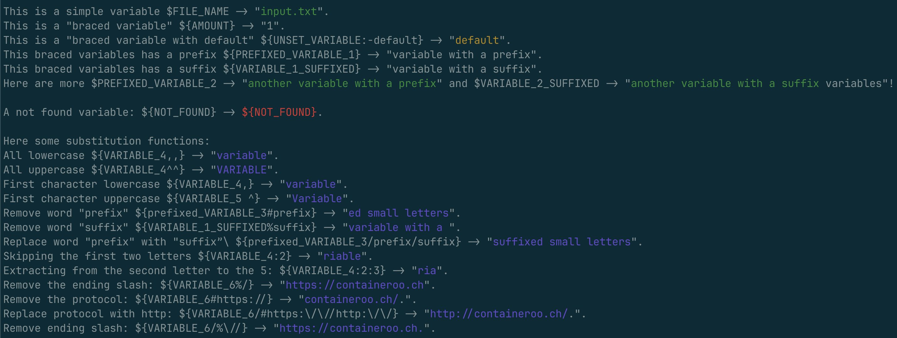

# renvsubst

`renvsubst` is a command-line tool that substitutes variables in the format `$VAR_NAME` or `${VAR_NAME}` with their corresponding environment values. If a variable is invalid, it remains unaltered.
Valid variable names start with a letter or underscore and can be followed by any combination of letters, numbers, or underscores.

"Braced variables" (`${VAR}`) support some bash string substitution functions, see below.

The main goal of renvsubst is to act as a lightweight, high-performance utility for use in container environments.

## Usage

```sh
Usage: renvsubst [FLAGS] [FILTERS] [INPUT] [OUTPUT] | [-h | --help | --version]
```

Short flags are available for many options and can be combined. For example, use `-ue` instead of `-u -e` or `--fail-on-unset --fail-on-empty`. See the list of flags and filters below for the complete list of short flags and their combinations.

## Flags

When the same flag is provided multiple times, renvsubst will throw an error.

| Parameter                  | Description                                                                                                                                                                                                                          |
| -------------------------- | ------------------------------------------------------------------------------------------------------------------------------------------------------------------------------------------------------------------------------------ |
| `-u`, `--fail-on-unset`    | Fails if an environment variable is not set.                                                                                                                                                                                         |
| `-e`, `--fail-on-empty`    | Fails if an environment variable is empty.                                                                                                                                                                                           |
| `-f`, `--fail`             | Alias for `--fail-on-unset` and `--fail-on-empty`.                                                                                                                                                                                   |
| `-U`, `--no-replace-unset` | Does not replace variables that are not set in the environment.                                                                                                                                                                      |
| `-E`, `--no-replace-empty` | Does not replace variables that are empty.                                                                                                                                                                                           |
| `-N`, `--no-replace`       | Alias for`--no-replace-unset` and `--no-replace-empty`.                                                                                                                                                                              |
| `-x`, `--no-escape`        | Disable escaping of variables.                                                                                                                                                                                                       |
| `-b`, `--unbuffer-lines`   | Do not buffer lines before printing. Saves memory, but may impact performance.                                                                                                                                                       |
| `-c`, `--color`            | Colorize the output if `stdout` is a terminal. Use `--no-replace-unset` to show not found variables; otherwise, they won't be displayed. |

## Filters

Every filter can be specified multiple times!

| Parameter                          | Description                                                                   |
| ---------------------------------- | ----------------------------------------------------------------------------- |
| `-p`, `--prefix`[=PREFIX]          | Only replace variables with the specified prefix.                             |
| `-s`, `--suffix`[=SUFFIX]          | Only replace variables with the specified suffix.                             |
| `-v`, `--variable`[=VARIABLE_NAME] | Specify variable to replace. If not provided, all variables will be replaced. |

The variables will be substituted according to the specified prefix, suffix, or variable name. If none of these options are provided, all variables will be substituted. When one or more options are specified, only variables that match the given prefix, suffix, or variable name will be replaced, while all others will remain unchanged.

If multiple identical prefixes, suffixes or variables are provided, only one copy of each will be used.

## Input

| Parameter              | Description                                                                                                                 |
| ---------------------- | --------------------------------------------------------------------------------------------------------------------------- |
| `-i`, `--input`[=FILE] | Path to the input file. If omitted, renvsubst will read from `stdin`. To use `stdin` explicitly, use `-` as the input file. |

## Output

| Parameter               | Description                                                                                                                    |
| ----------------------- | ------------------------------------------------------------------------------------------------------------------------------ |
| `-o`, `--output`[=FILE] | Path to the output file. If omitted, renvsubst will write to `stdout`. To use `stdout` explicitly, use `-` as the output file. |

## General

| Parameter        | Description                      |
| ---------------- | -------------------------------- |
| `-h` \| `--help` | Show help text.                  |
| `--version`      | Show the version of the program. |

## Substitution functions

| Expression                   | Description                                                      |
| :--------------------------- | :--------------------------------------------------------------- |
| `${VAR:-default}`            | Set `$VAR` to `default` if `$VAR` is unset.                      |
| `${VAR,}`                    | Change the first character of `$VAR` to lowercase.               |
| `${VAR,,}`                   | Change all characters of `$VAR` to lowercase.                    |
| `${VAR^}`                    | Change the first character of `$VAR` to uppercase.               |
| `${VAR^^}`                   | Change all characters of `$VAR` to uppercase.                    |
| `${VAR/pattern/replacement}` | Replace all occurrences of `pattern` with replacement.           |
| `${VAR:offset}`              | Shift `$VAR` by `n` characters from the start.                   |
| `${VAR:offset:length}`       | Shift `$VAR` by `n` characters with a maximum length of `len`.   |
| `${VAR#pattern}`             | Remove the shortest match of `pattern` from the start of `$VAR`. |
| `${VAR%pattern}`             | Remove the shortest match of `pattern` from the end of `$VAR`.   |

## Colors

Green represents variables that were successfully substituted.
Yellow denotes the use of default values.
Blue indicates variables where a string substitution took place.
Magenta indicates "ignored" variables, which had no filter applied.
Red represents variables that could not be substituted.

## Escaping

To retain a variable's original value and prevent it from being substituted by an environment variable, add a second dollar sign ($).
For example, to escape VAR_NAME, use `$$VAR_NAME`, `$${VAR_NAME}`, or `$${VAR_NAME:-DEFAULT_VALUE}`. The second dollar sign will be removed, resulting in `$VAR_NAME`, `${VAR_NAME}`, or `${VAR_NAME:-DEFAULT_VALUE}`.

To turn off escaping entirely, use the `--no-escape` flag.

`$${VAR_NAME}` will be replaced with `${VAR_NAME}`.
`$$VAR_NAME` will be replaced with `$VAR_NAME`.
`$${VAR_NAME:-DEFAULT_VALUE}` will be replaced with `${VAR_NAME:-DEFAULT_VALUE}`.

`I have a pa$$word` will be replaced with `I have a pa$word`. To escape this text, you have multiple options:

Escape the whole variable: `I have a pa$$$$word`.
Use the `--no-escape` flag.
Use the `--no-replace-empty` flag. If there is no environment variable named `word`, the variable will not be replaced.

## Examples

### Preparation

Create a test variable:

INPUT="""This is a "\$FILE_NAME" file.
It has more than "\${AMOUNT}" different variables.
You can also use "\${UNSET_VARIABLE:-default}" values inside variables like "\${UNSET_VARIABLE:-default}".
Here are more variable like "\${PREFIXED_VARIABLE_1}" and "\${VARIABLE_1_SUFFIXED}".
Here are more "\$PREFIXED_VARIABLE_2" and "\$VARIABLE_2_SUFFIXED" variables!

Here some substitution functions:
All lowercase \$\${VARIABLE_4,,} -> \${VARIABLE_4,,}.
All uppercase \$\${VARIABLE_4,,} -> \${VARIABLE_4,,}.
First character lowercase \$\${VARIABLE_4,} -> \${VARIABLE_4,}.
Remove word "prefix" \$\${prefixed_VARIABLE_3/prefix} -> \${prefixed_VARIABLE_3/prefix}
Replace word "prefix" with "suffix”\ \$\${prefixed_VARIABLE_3/prefix/suffix} -> \${prefixed_VARIABLE_3/prefix/suffix}.
Skipping the first two letters -> \${VARIABLE_4:2}.
Extracting from the second letter to the 5: \$\${VARIABLE_4:2:3} -> \${VARIABLE_4:2:3}.
Remove the ending slash: \$\${VARIABLE_6%/} -> \${VARIABLE_6%/}.
Remove the protocol: \$\${VARIABLE_6#https://} -> \${VARIABLE_6#https://}.

"""

Create a test file:

```sh
cat << EOF > input.txt
This is a simple variable \$\$FILE_NAME -> "\$FILE_NAME".
This is a "braced variable" \$\${AMOUNT} -> "\${AMOUNT}".
This is a "braced variable with default" \$\${UNSET_VARIABLE:-default} -> "\${UNSET_VARIABLE:-default}".
This braced variables has a prefix \$\${PREFIXED_VARIABLE_1} -> "\${PREFIXED_VARIABLE_1}".
This braced variables has a suffix \$\${VARIABLE_1_SUFFIXED} -> "\${VARIABLE_1_SUFFIXED}".
Here are more \$\$PREFIXED_VARIABLE_2 -> "\$PREFIXED_VARIABLE_2" and \$\$VARIABLE_2_SUFFIXED -> "\$VARIABLE_2_SUFFIXED variables"!

Here some substitution functions:
All lowercase \$\${VARIABLE_4,,} -> "\${VARIABLE_4,,}".
All uppercase \$\${VARIABLE_4^^} -> "\${VARIABLE_4^^}".
First character lowercase \$\${VARIABLE_4,} -> "\${VARIABLE_4,}".
First character uppercase \$\${VARIABLE_5 ^} -> "\${VARIABLE_5^}".
Remove word "prefix" \$\${prefixed_VARIABLE_3#prefix} -> "\${prefixed_VARIABLE_3#prefix}".
Remove word "suffix" \$\${VARIABLE_1_SUFFIXED%suffix} -> "\${VARIABLE_1_SUFFIXED%suffix}".
Replace word "prefix" with "suffix”\ \$\${prefixed_VARIABLE_3/prefix/suffix} -> "\${prefixed_VARIABLE_3/prefix/suffix}".
Skipping the first two letters \$\${VARIABLE_4:2} -> "\${VARIABLE_4:2}".
Extracting from the second letter to the 5: \$\${VARIABLE_4:2:3} -> "\${VARIABLE_4:2:3}".
Remove the ending slash: \$\${VARIABLE_6%/} -> "\${VARIABLE_6%/}".
Remove the protocol: \$\${VARIABLE_6#https://} -> "\${VARIABLE_6#https://}.".
Remove the protocol: \$\${UNSET_VAR#https://} -> "\${UNSET_VAR#https://}.".
Remove the protocol: \$\${VARIABLE_6#notfound} -> "\${UNSET_VAR#notfound}.".

EOF
```

Set variables:

```sh
export FILE_NAME=input.txt
export AMOUNT=1
export PREFIXED_VARIABLE_1="variable with a prefix"
export PREFIXED_VARIABLE_2="another variable with a prefix"
export prefixed_VARIABLE_3="prefixed small letters"
export VARIABLE_1_SUFFIXED="variable with a suffix"
export VARIABLE_2_SUFFIXED="another variable with a suffix"
export VARIABLE_3_suffixed="small letters suffix"
export VARIABLE_4="Variable"
export VARIABLE_5="variable"
export VARIABLE_6="https://containeroo.ch/"

```

### Commands

#### default usage

Replace all variables inside `input.txt` and output the result to `output.txt`:

```sh
renvsubst --input input.txt --output output.txt

# output.txt:

```

#### multiple filter

Replace only variables with the prefixes `PREFIXED` or `prefixed` or suffix `SUFFIXED` from the variable `INPUT` and output to `stdout`:

```sh
renvsubst --prefix PREFIXED --prefix=prefixed --suffix=SUFFIXED <<< $INPUT

# stdout:
This is a $FILE_NAME file.
It has more than ${AMOUNT} different variables.
You can also use ${UNSET_VARIABLE} values inside variables like ${UNSET_VARIABLE}.
Here are more variable like variable with a prefix and variable with a suffix.
Here are more another variable with a prefix and another variable with a suffix variables!

Here some substitution functions:
All lowercase ${VARIABLE_4,,} -> ${VARIABLE_4}.
All uppercase ${VARIABLE_4,,} -> ${VARIABLE_4}.
First character lowercase ${VARIABLE_4,} -> ${VARIABLE_4}.
Remove word "prefix" ${prefixed_VARIABLE_3/prefix} -> small letters
Replace word "prefix" with "suffix”\ ${prefixed_VARIABLE_3/prefix/suffix} -> small letters suffix.
Skipping the first two letters -> ${VARIABLE_4}.
Extracting from the second letter to the 5: ${VARIABLE_4:2:3} -> ${VARIABLE_4}.
Remove the ending slash: ${VARIABLE_6%/} -> ${VARIABLE_6}.
Remove the protocol: ${VARIABLE_6#https://} -> ${VARIABLE_6}.
```

#### colored output

```sh
cat input.txt | renvsubst -cU -i -
```



## container

Furthermore, there is a `renvsubst` container available in a minimal form. In the `deploy` directory, you can find Kubernetes manifests as examples. Please note that as the container uses `scratch` as the "base image," it lacks a shell within the container. Consequently, input/output redirection will **NOT** work at all. Instead, it is necessary to use the `-i|--input` and `-o|--output` options to pass data to `renvsubst`. Please refrain from using the `<` and `>` symbols to redirect input/output, as illustrated in the "bad" example. Instead, use the "good" example, which employs the `--input` and `--output` options to pass data.

**bad:**

```sh
renvsubst < input.txt > output.txt
```

**good:**

```sh
renvsubst --input input.txt --output output.txt
```
